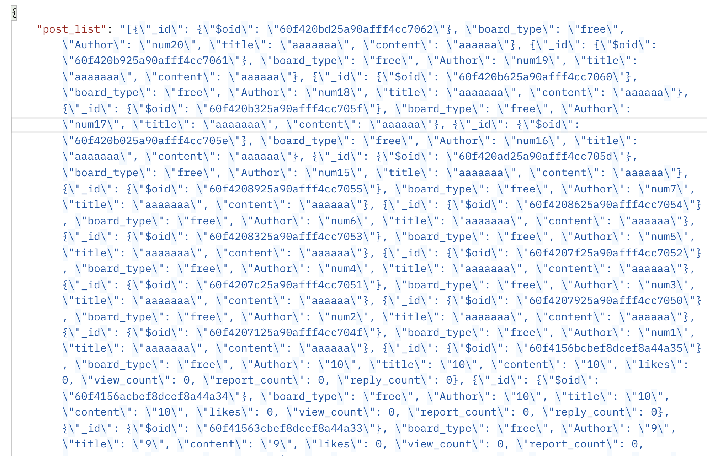

 <br>

 ## STEP1 페이지 구현 기법 선택  

 표시할 콘텐츠가 많은 경우, 데이터 로드를 위한 UX 패턴을 고민해보아야 합니다.  
 고려할 수 있는 디자인 패턴에는,  
 1.페이징(Pagination), 2.무한 스크롤(Infinite Scroll), 3.하이브리드(Hybrid)가 있습니다.  
 각 패턴은 서로 다른 장단점을 가지므로 제공하는 서비스의 특징, 웹/모바일 어플 여부 등을 기준으로 선택해야합니다.  
  
 1. 페이징(Pagination)
-  페이징은 콘텐츠를 별도의 페이지로 나누는 사용자 인터페이스 패턴을 말합니다.  
-  사용자가 페이지를 하단으로 스크롤하면 숫자 행을 제공합니다.  
-  각 해당 숫자는 사이트 또는 앱의 페이지를 나타냅니다.  

 2. 무한 스크롤(Infinite Scroll)  
-  무한 스크롤은 사용자가 페이지를 아래로 스크롤할 때 자동으로 페이지가 새로 고침 되는 패턴입니다.  
-  이 경우 사용자가 하단에 도달하면 더 많은 데이터가 새로고침 되므로 사용자는 Footer에 도달하기 어렵게 됩니다.  

 3. 하이브리드(Hybrid)  
-  하이브리드는 '더보기'버튼을 구현함으로써 페이징과 무한 스크롤을 혼합한 형태라고 볼 수 있습니다.  
-  사용자가 하단에 도달하면 더보기 버튼을 보여주고, 사용자가 이를 클릭하는 경우에만 페이지가 새로 고침 됩니다.  

 ### 무한 스크롤 선택 이유  
 
 커뮤니티 모바일 애플리케이션의 경우 무한 스크롤 방식이 주로 사용됩니다.  
 1. 커뮤니티 서비스는 사용자가 오래 머물 수 있도록 해야하며, 
 2. 모바일 애플리케이션의 경우 클릭 보다는 스크롤이 더 간편하기 때문입니다.  


 <br>
 <br>

 ## STEP2 무한 스크롤 구현  
 
 무한 스크롤을 구현하기 위해서는,

 클라이언트는 사용자의 스크롤을 감지해야하고, 사용자가 하단에 도달하는 경우 서버에 새로운 페이지를 요청해야합니다.  
 서버는 해당 요청에 따라 새로운 데이터를 보내주어야 합니다.  
 <br> 

 새로운 데이터를 보내주는 방식으로 skip과 limit를 동시에 활용할 수 있지만,  
 skip의 경우 모든 데이터를 불러오기 때문에 성능 상 문제가 발생할 수 있습니다.  
 ```python
 data = db.users.find({}).skip((page-1)*20).limit(20)
 ```

 위와 같은 방식 대신, 이전에 불러온 데이터 "이외의" 데이터만 보내주는 방식을 사용할 수 있습니다.  
  ```MongoDB```의 경우 데이터 저장 시 _id가 자동적으로 생성됩니다. _id는 단순 string이 아니고, 유닉스 시간을 포함하여 구성됩니다.  
  따라서 클라이언트와 서버가 주고받는 도큐먼트(document) 중 마지막 도큐먼트의 _id를 기준으로 사용할 수 있습니다.  

<br>
 이를 적용하면 다음과 같이 작성할 수 있습니다.  

 ```python
 data = db.users.find({'_id':{$gt:last_id}).limit(20)
 ```

 정리하자면, 
 - 클라이언트는 "지난 페이지 마지막 도큐멘트의 _id"와 함께 새로운 페이지를 요청하고,  
 - 서버는 받은 _id를 기준으로 이전에 불러온 데이터 "이외의" 데이터를 찾아서 보내주면 됩니다.  
  

<br>
<br>

 ## STEP3 오류 및 디버깅  
 
  _주의 : python 코드에서 함수선언부분은 생략되어있습니다._  
  
<br>

 ### 1 document sorting 시 dictionary 사용하는 경우 TypeError가 발생합니다.  
 
 <br> 
 도큐먼트를 쿼리할 때 정렬기능(sort)을 사용할 수 있습니다.  
 
 ```pymongo``` 의 sort()는 정렬의 기준이 되는 key와 direction을 매개 변수로 사용합니다.  
 
 이때 direction은 1(정방향), -1(역방향)입니다.
 <br>
 만약 최근에 저장된 도큐먼트부터 쿼리하고 싶다면 _id를 기준이 되는 key로 사용하고, direction은 -1로 설정하면 됩니다. 
   
 ```python
 data = db.users.find({}).sort({"_id": -1})
 ```
 
 하지만 TypeError가 발생하게 됩니다.  
 
 ```python
 TypeError: if no direction is specified, key_or_list must be an instance of lis
 ```
 <br>
 
 이러한 오류가 발생하는 이유는,   
 정렬 기능을 사용하는 경우 어떠한 기준을 먼저 적용할 것인지를 나타내야하는데    
 딕셔너리(dict)는 순서가 지정되지 않기 때문입니다.    
 따라서 리스트(list)를 활용하여 문제를 해결했습니다.  
 
 ```python
 data = db.users.find({}).sort([("_id",-1)])
 ```
 
 <br>
 <br>

 ### 2 find 결과를 그대로 return 하는 경우 TypeError가 발생합니다.  
 
<br>

 ```MongoDB```는 BSON(Biary JSON) 형식으로 데이터를 저장하지만, 데이터를 쿼리하는 경우 각 도큐먼트가 JSON형식으로 반환됩니다.  
 따라서 별도의 "변환"과정이 필요하지는 않습니다.  
 
 하지만 _id의 경우 자동으로 JSON형태로 변환되지 않기 때문에 오류가 발생합니다.  
 또한 find를 통해 2개 이상의 도큐먼트를 불러오는 경우에는 Cursor가 반환되므로 오류가 발생합니다.    
 <br>

 1. _id 문제 
 
```python
TypeError: Object of type ObjectId is not JSON serializable
```
이러한 문제는 projection을 통해 _id를 제외하고 쿼리하는 방식으로 해결할 수 있습니다.
```python
 data = db.users.find({}, {"_id": 0})
```
 하지만 이 방법은 _id도 같이 return을 해야하는 경우에는 사용할 수 없는 방법입니다. 
<br>
 이를 해결하기 위해 for문을 활용하여 "_id"를 string 타입으로 변환해주었습니다.
 
 ```python
 data = db.users.find({})
 for doc in data:
     doc["_id"] = str(doc["-id"])
 ```
 <br>

 2. Cursor 문제   
 ```pymongo``` 에는 도큐먼트를 쿼리하는 메서드로 find_one,과 find가 있습니다.  
 find_one은 1개의 도큐먼트만 쿼리하는 메서드입니다.  
 페이지 기능을 구현하려면 여러 개의 도큐먼트를 쿼리해야하므로 find메서드를 사용해야합니다.  
 find메서드를 통해 쿼리한 도큐먼트를 바로 return하는 경우 Cursor자료형이므로 다음과 같은 에러가 발생합니다.  

```python
TypeError: Object of type Cursor is not JSON serializable
```
 Cursor to JSON으로 서치한 결과,  
 bson모듈의 json_util이라는 tool의 dumps 함수를 찾았습니다.
 
 ```python
 from bson.json_util import dumps
 data = db.users.find({})
 return dumps(data)
 ```
 
 ```postman```을 활용하여 ```GET```을 해보았으나 만족스럽지 않았습니다.
 <br>
 
 

 따라서 for문을 활용하여 각 도큐먼트를 리스트에 append하는 방식을 택하였습니다.
 (_id도 포함하여 return해야하므로 1번 코드도 포함해야합니다)
 ```python
 data = db.users.find({})
 documents = []
 for doc in data:
     doc["_id"] = str(doc["_id"])
     documents.append(doc)
    
 return documents
 ```
 <br>
 <br>

 ### 3 더 이상 불러올 도큐먼트가 없는 경우 IndexError가 발생합니다.  
 
 <br>

 2번 과정을 거친 결과 documents라는 리스트를 얻게 되었습니다.  
 이 리스트는 쿼리한 각 도큐먼트로 구성되어 있습니다.  
 이제 기준으로 사용할 "마지막 도큐먼트의 _id"를 전달해주기 위해 다음과 같은 코드를 추가할 수 있습니다.  
 ```python
 last_document_id = documents[-1]["_id"]
 ```
 ```postman```으로 테스트해본 결과 초반에는 오류가 발생하지 않습니다.   
 하지만 클라이언트가 컬랙션(collection)의 마지막 도큐먼트 _id와 함께 새로운 페이지를 요청하는 경우,  
 (즉 더 이상 불러올 도큐먼트가 없는 경우)  
 IndexError가 발생합니다.  
 왜냐하면, documents에는 아무런 요소가 없는데 [-1]인덱스를 사용했기 때문입니다.
```python
IndexError: list index out of range
```
이러한 오류는 예외처리 문법(try, except)으로 해결했습니다.
```python
try:
    data = db.users.find({})
    documents = [] 
    for doc in data:
        doc["_id"] = str(doc["_id"])
        documents.append(doc)
    return documents

except IndexError:
    return None
```
<br>

 ### 4 string type의 _id는 query criteria로 사용할 수 없습니다.  
 
 <br>

 서버와 클라이언트는 string 타입으로 _id를 주고받습니다.  
 하지만 Pymongo에서 query criteria로 _id를 사용하려면 binary json형식으로 조회해야합니다.  
 따라서 클라이언트로 부터 받은 _id를 last_document_id라고 한다면, 
```python
    from bson.objectid import ObjectId
    data = db.users.find({"_id":{$gt:ObjectId(last_document_id)}})
```
이렇게 작성할 수 있습니다.

<br>
<br>

## 정리 

1. 다양한 페이지 구현 기법 중 모바일 커뮤니티 애플리케이션에는 무한 스크롤 방식이 적합합니다.
2. 무한 스크롤을 구현하기 위해 "마지막 도큐먼트의 _id"를 기준으로 삼을 수 있습니다.
3. 오류를 디버깅한 최종적인 코드는 다음과 같습니다.
   ```python
   from bson.objectid import ObjectId
   try:
       data = db.users.find({"_id":{$lt:ObjectId(last_document_id)}}).sort([("_id",-1)]).limit(10)
       # 1번, 4번 오류 디버그
       documents = []
       for doc in data:
           doc["_id"]=str(doc["_id"])
           documents.append(doc)
        return documetns
        # 2번 오류 디버그
    except IndexError:
    # 3번 오류 디버그
        return None
   ```
   
   다음 시간에는 bcrypt, jwt에 대해서 다뤄보겠습니다.  
   
   감사합니다 :)
